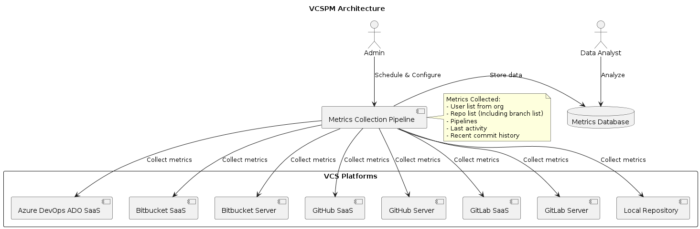

# GPM (Git Platform Metrics )

## Overview
This project provides an architecture for a development lifecycle tooling system aimed at collecting metrics from various Version Control Systems (VCS). The system will collect and store metrics from multiple Git platforms and allow for periodic analysis.

Supported Platforms:
1. Azure DevOps ADO SaaS
1. Bitbucket SaaS
1. Bitbucket Server
1. GitHub SaaS
1. GitHub Server
1. GitLab SaaS
1. GitLab Server
1. Local Repository

Metrics Collected:
1. User list from org
1. Repository list (including branch list)
1. Pipelines
1. Last activity
1. Recent commit history


## Multi-VCS Architecture Diagram



### Description

The Multi-VCS Architecture diagram illustrates the workflow for collecting and analyzing development lifecycle metrics from multiple version control systems (VCS). The architecture supports a range of Git platforms and provides a scalable solution for metric collection and analysis. Here’s a detailed breakdown of the components and their interactions:

1. **Admin**:
   - **Role**: Configures and schedules the `Metrics Collection Pipeline`.
   - **Interaction**: Directs how the pipeline should collect metrics from each VCS platform.

2. **Metrics Collection Pipeline**:
   - **Role**: A centralized pipeline that gathers metrics from various VCS platforms.
   - **Function**: Executes scheduled tasks to collect data on user activities, repository lists, pipelines, last activities, and recent commits from each integrated VCS.
   - **Collected Metrics**:
     - User list from the organization
     - Repository list (including branch list)
     - Pipelines
     - Last activity
     - Recent commit history
   - **Interaction**: Periodically collects data from the VCS platforms and stores it in the `Metrics Database`.

3. **VCS Platforms**:
   - **Components**:
     - Azure DevOps ADO SaaS
     - Bitbucket SaaS
     - Bitbucket Server
     - GitHub SaaS
     - GitHub Server
     - GitLab SaaS
     - GitLab Server
     - Local Repository
   - **Role**: Each VCS platform provides specific metrics about development activities.
   - **Interaction**: The `Metrics Collection Pipeline` interfaces with these platforms to extract relevant metrics.

4. **Metrics Database**:
   - **Role**: A centralized database (e.g., MongoDB) where all collected metrics are stored.
   - **Function**: Provides persistent storage for the metrics, facilitating easy querying and analysis.
   - **Interaction**: Receives data from the `Metrics Collection Pipeline` and makes it available for analysis.

5. **Data Analyst**:
   - **Role**: Analyzes the stored metrics to generate insights and reports.
   - **Interaction**: Queries the `Metrics Database` to retrieve and analyze the collected metrics data.

### Workflow

- **Admin Configuration**: The `Admin` configures the `Metrics Collection Pipeline` to specify what metrics to collect and when.
- **Metrics Collection**: The `Metrics Collection Pipeline` connects to each VCS platform (including Azure DevOps, Bitbucket, GitHub, GitLab, and Local repositories) and gathers the defined metrics. This process runs on a scheduled basis (e.g., daily).
- **Data Storage**: Collected metrics are stored in the `Metrics Database`.
- **Analysis**: The `Data Analyst` accesses the `Metrics Database` to perform analysis, create reports, and derive insights from the data.

### Purpose

This architecture supports an organized and scalable method for collecting and analyzing metrics from multiple VCS platforms. It allows organizations to gain a comprehensive view of their development activities, enabling better decision-making based on accurate and timely metrics.


Store Data in MongoDB:

Modify your script to insert the collected metrics into MongoDB.

Example MongoDB insertion (using Python with pymongo):

```python
from pymongo import MongoClient

client = MongoClient('mongodb://localhost:27017/')
db = client['metrics']
collection = db['metrics_data']

# Insert collected data
with open('user_list.txt') as f:
    users = f.readlines()
collection.insert_one({'type': 'users', 'data': users})
```

Query the Database: Use MongoDB query tools or applications to analyze the stored metrics.

## Contributing
Contributions are welcome! Please submit a pull request or file an issue to discuss improvements or new features.

## License
This project is licensed under the MIT License - see the LICENSE file for details.

## Key Points in the README:
1. Overview: Describes the project goals and supported platforms.
1. Current Implementation Example: Details the current state focusing on the local repository.
1. Future Implementation: Provides a brief overview of planned support for multiple VCS platforms.
1. Setup Instructions: Guides users on setting up the local repository example.
1. Contributing and License sections provide standard project guidelines.


